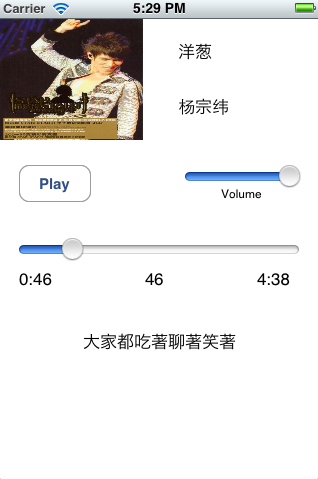

ZiggSongController
==================

A Simple iOS Audio Controller 

[Download Zip Pack]
[Download Zip Pack]: https://github.com/ziggear/ZiggSongController/archive/master.zip "download"

Usage
-----

*  Copy files in Classes/ to your project folder
*  Add files to your project in Xcode
*  Add framework "AVFoundation" and "QuartzCore" to Link Binary With Libraries
*  Import only ZiggSongController.h and use class "ZiggSongController"

Screen Shots
------------

Weaks and Limits
----------------

*  Cannot show correct time when duration > 60min
*  Have low efficiency in loading and showing lrc files

